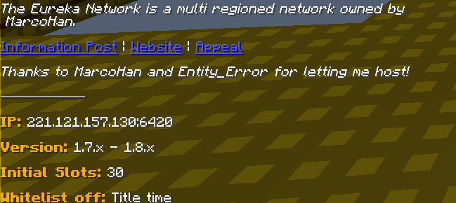

MatchPost
=========

**Requires: Java 7+ and Spigot 1.8+**

This is a plugin that helps players by allowing them to view a copy of the match post in-game.

The plugin tries to format the Reddit markdown in a way that is usable in-game. (links are clickable e.t.c.). Reddit
tables are currently not supported and will not show up in chat.

Example:

Anything stored in `current.md` is automatically loaded on server startup as the match post. 
Commands will also modify the `current.md` file to make sure they stick across restarts.
If no `current.md` file exists on startup it is assumed there is no post. If you change the contents 
of the file, use `/matchpost current.md` to use the new contents.

# Commands

## `/matchpost`

Shows the currently selected matchpost contents to whoever typed it

Permission: `uhc.matchpost.command.use` - default true (all players)

## `/matchpost <filename>`

e.g. `/matchpost game.md`

Sets the matchpost to the contents of the given file in the config folder. 

Writes the contents into `current.md` for use on reload/restart.

Permission: `uhc.matchpost.command.set` - default op

## `/matchpost reddit <code>`

e.g. `/matchpost reddit 3lnxmd`

Writes the contents of the given reddit post to `current.md` and then uses them as the given post.

Permission: `uhc.matchpost.command.set` - default op

## `/matchpost clear`

Clears the current match post and deletes `current.md`

Permission: `uhc.matchpost.command.set` - default op